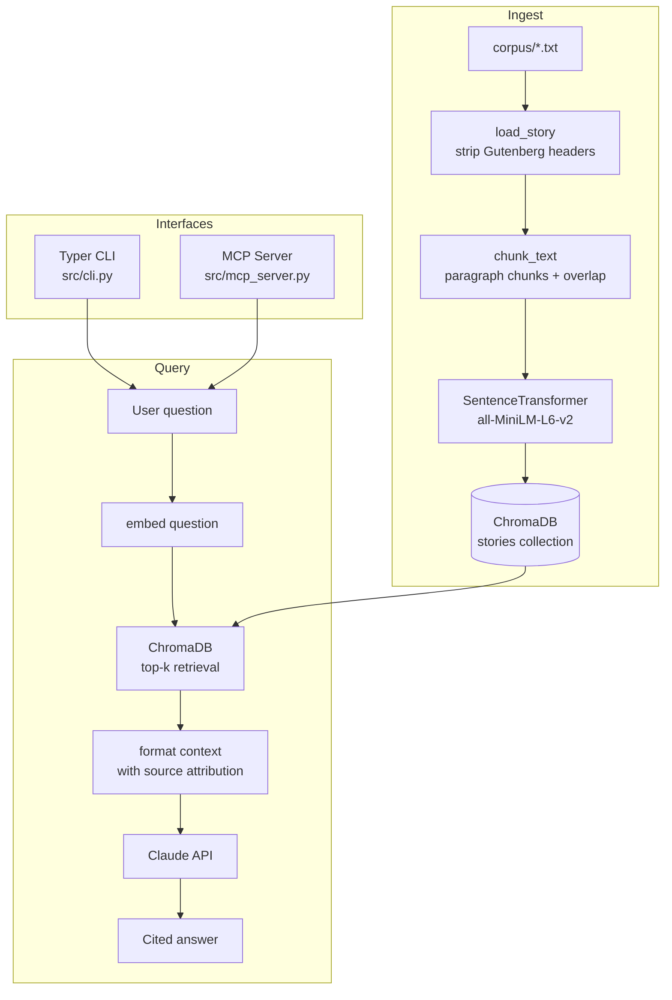

# Short Story Q&A

A RAG (Retrieval-Augmented Generation) system over public-domain short stories, exposed as an MCP server.

## Stack

| Component | Library |
|---|---|
| Vector DB | ChromaDB (local, persistent) |
| Embeddings | `sentence-transformers` (`all-MiniLM-L6-v2`) |
| LLM | Anthropic Claude API |
| MCP server | MCP Python SDK |
| CLI | Typer + Rich |
| Tests | pytest |

## Status

| Module | Status |
|---|---|
| `src/ingest.py` | Done — Gutenberg header/footer stripping, paragraph chunking with overlap, embedding, ChromaDB storage |
| `scripts/ingest.py` | Done — entry point to ingest the corpus |
| `scripts/search.py` | Done — raw similarity search for sanity checks |
| `src/retrieval.py` | Not yet implemented |
| `src/qa.py` | Not yet implemented |
| `src/cli.py` | Not yet implemented |
| `src/mcp_server.py` | Not yet implemented |
| `scripts/evaluate.py` | Not yet implemented |

## Corpus

4 public-domain short stories in `corpus/`:

- Ambrose Bierce — *An Occurrence at Owl Creek Bridge*
- Edgar Allan Poe — *The Cask of Amontillado*
- Philip K. Dick — *Beyond Lies the Wub*
- W. W. Jacobs — *The Monkey's Paw*

## Setup

```bash
# Create and activate conda environment
conda activate claude-e2e

# Install dependencies
pip install -r requirements.txt

# Set up API key
echo "ANTHROPIC_API_KEY=your_key_here" > .env
```

## Usage

```bash
# Ingest corpus into ChromaDB
python scripts/ingest.py

# Sanity check — raw similarity search
python scripts/search.py

# Q&A CLI (not yet implemented)
python -m src.cli ask "your question here"
python -m src.cli list
python -m src.cli summarize "Story Title"

# Start MCP server (not yet implemented)
python -m src.mcp_server
```

## Architecture



### File layout

```
claude-e2e/
├── corpus/          # Raw .txt stories (Author-Name_Story-Title.txt)
├── src/
│   ├── ingest.py    # Strip Gutenberg headers → chunk → embed → store in ChromaDB
│   ├── retrieval.py # Similarity search against ChromaDB (pending)
│   ├── qa.py        # Retrieve → prompt Claude → cited answer (pending)
│   ├── cli.py       # Typer CLI: ask / list / info / summarize (pending)
│   └── mcp_server.py# MCP tools: ask_question, summarize_story, list_stories (pending)
├── eval/
│   ├── questions.json  # Hand-crafted Q&A pairs with difficulty labels
│   └── results/        # Evaluation run outputs
├── scripts/
│   ├── ingest.py    # Runs src/ingest.py over corpus/
│   ├── search.py    # Manual similarity search for sanity checks
│   └── evaluate.py  # Retrieval recall@k + LLM-as-judge scoring (pending)
└── chroma_db/       # Persistent ChromaDB storage (gitignored)
```

### Key data flow (planned)

1. **Ingest** — strip Gutenberg boilerplate → paragraph-chunk with overlap → embed via `sentence-transformers` → store in ChromaDB with metadata (`story_title`, `author`, `chunk_index`, `char_start`, `char_end`)
2. **Q&A** — user question → ChromaDB top-k retrieval → context block with source attribution → Claude API prompt → cited answer
3. **MCP** — `src/mcp_server.py` wraps Q&A and summarization as MCP tools for Claude Desktop integration

## Tests

```bash
pytest tests/
pytest tests/test_ingestion.py::test_header_stripping -v
```
